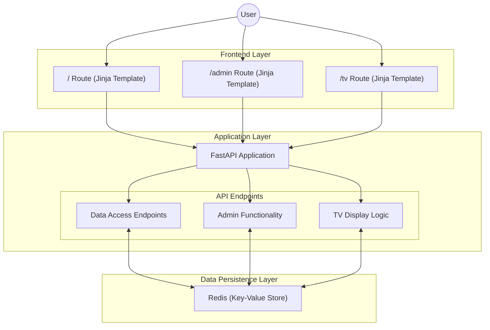
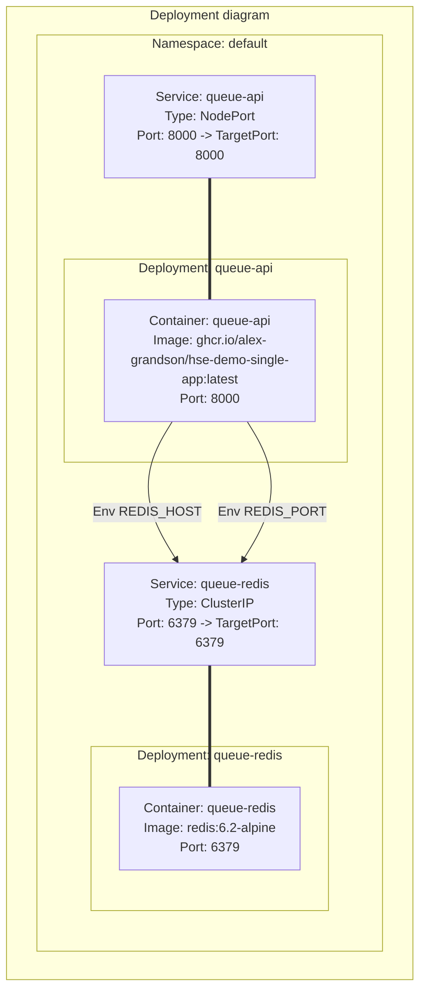

# Схемы

## Общая схема

```mermaid
flowchart TD
    subgraph "Frontend Layer"
        RootRoute["/ Route (Jinja Template)"]
        AdminRoute["/admin Route (Jinja Template)"]
        TVRoute["/tv Route (Jinja Template)"]
    end

    subgraph "Application Layer"
        FastAPI["FastAPI Application"]
        subgraph "API Endpoints"
            DataEndpoints["Data Access Endpoints"]
            AdminEndpoints["Admin Functionality"]
            TVEndpoints["TV Display Logic"]
        end
    end

    subgraph "Data Persistence Layer"
        Redis["Redis (Key-Value Store)"]
    end

    User((User)) --> RootRoute & AdminRoute & TVRoute
    RootRoute & AdminRoute & TVRoute --> FastAPI
    FastAPI --> DataEndpoints & AdminEndpoints & TVEndpoints
    DataEndpoints & AdminEndpoints & TVEndpoints <--> Redis


```

## Диаграмма деплоя

```mermaid
flowchart TD
    subgraph K8sCluster["Deployment diagram"]
        subgraph QueueNamespace["Namespace: default"]
            subgraph QueueAPI["Deployment: queue-api"]
                QAContainer["Container: queue-api<br/>Image: ghcr.io/alex-grandson/hse-demo-single-app:latest<br/>Port: 8000"]
            end
            QAService["Service: queue-api<br/>Type: NodePort<br/>Port: 8000 -> TargetPort: 8000"]
            subgraph QueueRedis["Deployment: queue-redis"]
                QRContainer["Container: queue-redis<br/>Image: redis:6.2-alpine<br/>Port: 6379"]
            end
            QRService["Service: queue-redis<br/>Type: ClusterIP<br/>Port: 6379 -> TargetPort: 6379"]
        end
    end

    QAContainer -- Env REDIS_HOST --> QRService
    QAContainer -- Env REDIS_PORT --> QRService
    QAService === QAContainer
    QRService === QRContainer

```

## Диаграмма потока траффика

```mermaid
flowchart LR
    User((External User)) -->|HTTP Request| Ingress

    subgraph "Kubernetes Cluster"
        Ingress -->|Routes by Path| APIService["Service: queue-api\n(NodePort)"]
        APIService -->|Port 8000| APIPod["Pod: queue-api"]
        APIPod -->|Redis Commands Port 6379| RedisService["Service: queue-redis\n(ClusterIP)"]
        RedisService -->|Port 6379| RedisPod["Pod: queue-redis"]
        RedisPod <-->|Persistent Storage| PVC["PVC: Redis Data"]
    end

    style User fill:#f96,stroke:#333,stroke-width:2px
    style Ingress fill:#bbf,stroke:#333,stroke-width:2px
    style APIPod fill:#bfb,stroke:#333,stroke-width:2px
    style RedisPod fill:#fbf,stroke:#333,stroke-width:2px
    style PVC fill:#ff9,stroke:#333,stroke-width:2px
```
